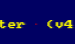
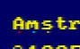
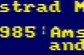
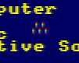

# RETO 1.P10: Pinta por la pantalla
Copia más abajo tus programas, cada uno en su parte del reto.

# PROGRAMAS

## Actividad 1: Píxel entre letras
El píxel debe estar fuera de la primera fila de pantalla.
```
3E 88 32 7E D8 18 FE
```
PC: 4000

## Actividad 2: Tres píxeles debajo de 3 letras
Los píxeles deben ser de 3 colores distintos y no estar en la primera fila de pantalla.
```
3E 88 32 A3 C0 3E 08 32 A5 C0 3E 80 32 A7 C0 18 FE
```
PC: 4000

## Actividad 3: Columna de 5 píxeles consecutivos
Los píxeles deben formar un dibujito en vertical, en la misma columna.
```
3E 80 32 FD C0 3E 08 32 FD C8 3E 88 32 FD D0 3E 08 32 FD D8 3E 80 32 FD E0 18 FE
```
PC: 4000

## Actividad 4: Minidibujo en 3 columnas
Mínimo 4 filas de altura y 3 columnas distintas.
```
3E 88 32 18 C1 32 18 D9 32 19 C1 32 19 D9 32 1A C1 32 1A D9 3E 80 32 18 C9 32 19 C9 32 1A C9 3E 08 32 18 D1 32 19 D1 32 1A D1 3E 22 32 C8 E0 32 C8 F8 32 C9 E0 32 C9 F8 3E 20 32 C8 E8 32 C9 E8 3E 02 32 C8 F0 32 C9 F0 18 FE
```
PC: 4000

# IMAGENES




